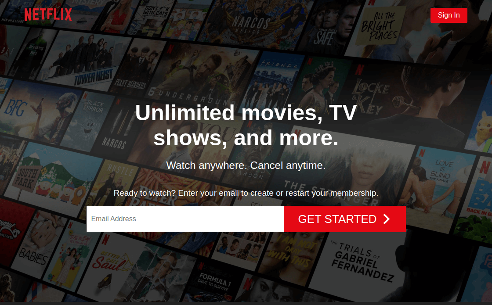

[![LinkedIn][linkedin-shield]][linkedin-url]

<!-- PROJECT LOGO -->
<p align="center">
  <h3 align="center">Netflix</h3>
  <p align="center">
    A clone of netflix.com where users can authenticate themselves, select viewer profiles, browse films and series, and watch vidoes online.
    <br />
    <a href="https://github.com/minhajul-karim/netflix"><strong>Explore the docs »</strong></a>
    <br />
    <br />
    <a href="https://netflix-mk.netlify.app/">View Demo</a>
    ·
    <a href="https://github.com/minhajul-karim/netflix/issues">Report Bug</a>
    ·
    <a href="https://github.com/minhajul-karim/netflix/issues">Request Feature</a>
  </p>
</p>

<!-- TABLE OF CONTENTS -->
<details open="open">
  <summary><h2 style="display: inline-block">Table of Contents</h2></summary>
  <ol>
    <li>
      <a href="#about-the-project">About The Project</a>
      <ul>
        <li><a href="#built-with">Built With</a></li>
      </ul>
    </li>
    <li>
      <a href="#getting-started">Getting Started</a>
      <ul>
        <li><a href="#prerequisites">Prerequisites</a></li>
        <li><a href="#installation">Installation</a></li>
      </ul>
    </li>
    <li><a href="#usage">Usage</a></li>
    <li><a href="#contributing">Contributing</a></li>
    <li><a href="#license">License</a></li>
    <li><a href="#contact">Contact</a></li>
    <li><a href="#acknowledgements">Acknowledgements</a></li>
  </ol>
</details>

<!-- ABOUT THE PROJECT -->

## About The Project

<p align="center">
  <a href="https://netflix-mk.netlify.app/">
    
  </a>
</p>

### Built With

- [React](https://reactjs.org/)
- [styled-components](https://styled-components.com/)
- [React Router](https://reactrouter.com/)
- [Firebase](https://firebase.google.com/)

<!-- GETTING STARTED -->

## Getting Started

To get a local copy up and running, follow these simple steps.

### Prerequisites

- npm
  ```sh
  npm install npm@latest -g
  ```
  or
  ```sh
  npm install --global yarn
  ```

### Installation

1. Clone the repo
   ```sh
   git clone https://github.com/minhajul-karim/netflix.git
   ```
2. Install NPM packages
   ```sh
   npm install
   ```
   or
   ```sh
   yarn install
   ```
3. Start the development server

   ```sh
   npm start
   ```

   or

   ```sh
   yarn start
   ```

   Open http://localhost:3000 to view it in the browser.

<!-- USAGE EXAMPLES -->

## Usage

### Authentication

We authenticate users using an email address and a password with Firebase.

### Data

We have used Firestore to store our films and series data. We hydrate Firestore by importing data from `src/seed.js` that produces two collections of the film and series. Each entry of a collection has a `genre` property. To display data categorically, we filter each collection by `genre` of each entry which looks like this:

```
{
  series: [
    {
        title: 'Documentaries',
        data: [{}, {}, {}],
      },
      {
        title: 'Comedies',
        data: [{}, {}, {}],
      },
  ],
  films: []
}
```

### Beautification

We have adopted the CSS-in-JS approach to style this application and used styled components. It helps us to encapsulate the styles within the components. Styled components also give us out-of-the-box CSS support like nesting styles and variables with exceptional theming support.

### Modularity

We have built a component library using compound components design pattern. It helps us to encapsulate most of the component-related logic within the components.

### Routing

We have enabled application routing using React Router's BrowserRouter that uses HTML5 history API.

### State Management

We have used Context API for global state management and sharing states between the parent and children within compound components.

### Play Video

The challenge with the video player was it lives deep in the DOM, but we needed to bring it on top of all other DOM nodes whenever the user decides to play a video preserving its position in the React hierarchy. We have accomplished this via React Portal.

### Architecture

```
.
├── app.js
├── components
│   ├── accordion
│   │   ├── index.js
│   │   └── styles
│   │       └── accordion.js
│   ├── activityIndicator
│   │   ├── index.js
│   │   └── styles
│   │       └── activityIndicator.js
│   ├── card
│   │   ├── index.js
│   │   └── styles
│   │       └── card.js
│   ├── feature
│   │   ├── index.js
│   │   └── styles
│   │       └── feature.js
│   ├── footer
│   │   ├── index.js
│   │   └── styles
│   │       └── footer.js
│   ├── form
│   │   ├── index.js
│   │   └── styles
│   │       └── form.js
│   ├── header
│   │   ├── index.js
│   │   └── styles
│   │       └── header.js
│   ├── index.js
│   ├── jumbotron
│   │   ├── index.js
│   │   └── styles
│   │       └── jumbotron.js
│   ├── opt-form
│   │   ├── index.js
│   │   └── styles
│   │       └── opt-form.js
│   ├── player
│   │   ├── index.js
│   │   └── styles
│   │       └── player.js
│   └── profile
│       ├── index.js
│       └── styles
│           └── profile.js
├── constants
│   └── routes.js
├── containers
│   ├── browse.js
│   ├── faq.js
│   ├── footer.js
│   ├── header.js
│   ├── jumbotron.js
│   └── profile.js
├── context
│   ├── firebase.js
│   └── themeContext.js
├── fixtures
│   ├── faqs.json
│   └── jumbo.json
├── global-styles.js
├── helpers
│   └── routes.js
├── hooks
│   ├── index.js
│   ├── use-auth-listener.js
│   └── use-content.js
├── index.js
├── pages
│   ├── add-profile.js
│   ├── browse.js
│   ├── home.js
│   ├── index.js
│   ├── signin.js
│   └── signup.js
├── seed.js
├── theme
│   └── schema.json
└── utils
    ├── index.js
    └── selection-map.js
```

<!-- CONTRIBUTING -->

## Contributing

Contributions are what make the open source community such an amazing place to be learn, inspire, and create. Any contributions you make are **greatly appreciated**.

1. Fork the Project
2. Create your Feature Branch (`git checkout -b feature/AmazingFeature`)
3. Commit your Changes (`git commit -m 'Add some AmazingFeature'`)
4. Push to the Branch (`git push origin feature/AmazingFeature`)
5. Open a Pull Request

<!-- LICENSE -->

## License

Distributed under the MIT License. See `LICENSE` for more information.

<!-- CONTACT -->

## Contact

Minhajul Karim - [@minhajul93](https://twitter.com/minhajul93) - minhajul.kaarim@gmail.com

Project Link: [https://github.com/minhajul-karim/netflix](https://github.com/minhajul-karim/netflix)

<!-- ACKNOWLEDGEMENTS -->

## Acknowledgements

- [The Frontend Developer Career Path](https://scrimba.com/learn/frontend)
- [Karl Hadwen](https://twitter.com/karlhadwen)

<!-- MARKDOWN LINKS & IMAGES -->
<!-- https://www.markdownguide.org/basic-syntax/#reference-style-links -->

[contributors-shield]: https://img.shields.io/github/contributors/minhajul-karim/repo.svg?style=for-the-badge
[contributors-url]: https://github.com/minhajul-karim/repo/graphs/contributors
[forks-shield]: https://img.shields.io/github/forks/minhajul-karim/repo.svg?style=for-the-badge
[forks-url]: https://github.com/minhajul-karim/repo/network/members
[stars-shield]: https://img.shields.io/github/stars/minhajul-karim/repo.svg?style=for-the-badge
[stars-url]: https://github.com/minhajul-karim/repo/stargazers
[issues-shield]: https://img.shields.io/github/issues/minhajul-karim/repo.svg?style=for-the-badge
[issues-url]: https://github.com/minhajul-karim/repo/issues
[license-shield]: https://img.shields.io/github/license/minhajul-karim/repo.svg?style=for-the-badge
[license-url]: https://github.com/minhajul-karim/repo/blob/master/LICENSE.txt
[linkedin-shield]: https://img.shields.io/badge/-LinkedIn-black.svg?style=for-the-badge&logo=linkedin&colorB=555
[linkedin-url]: https://linkedin.com/in/minhajul-karim
